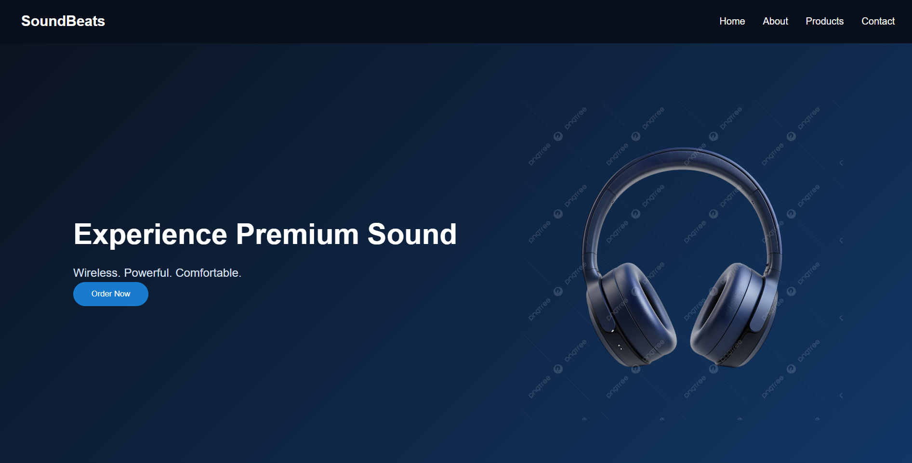
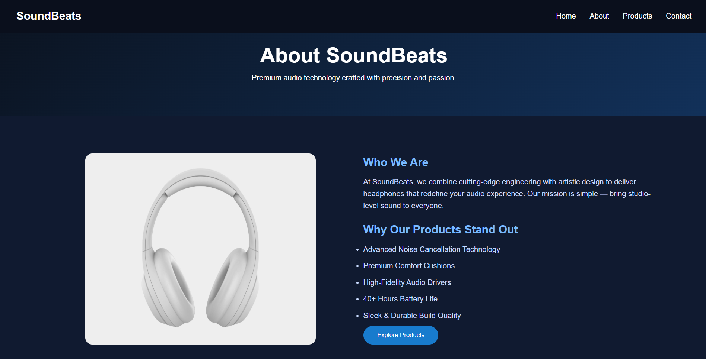
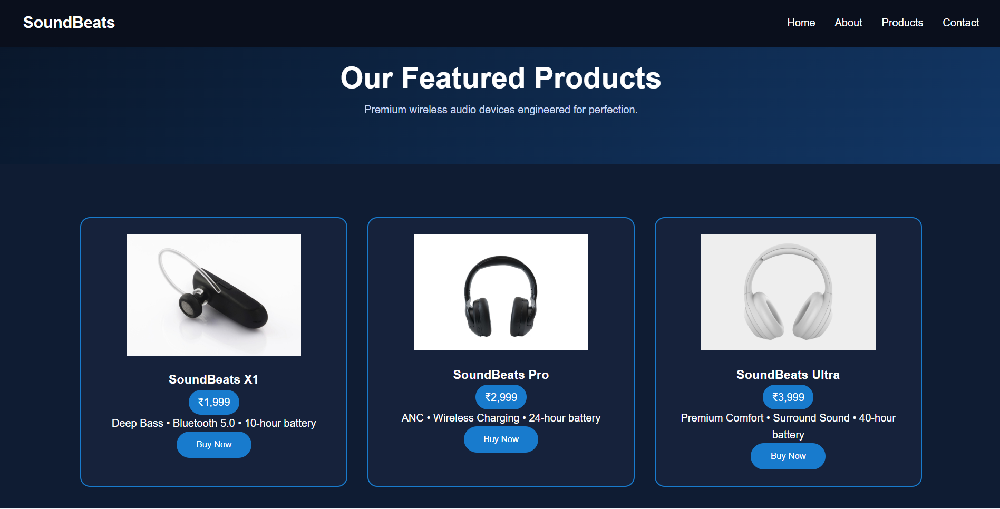
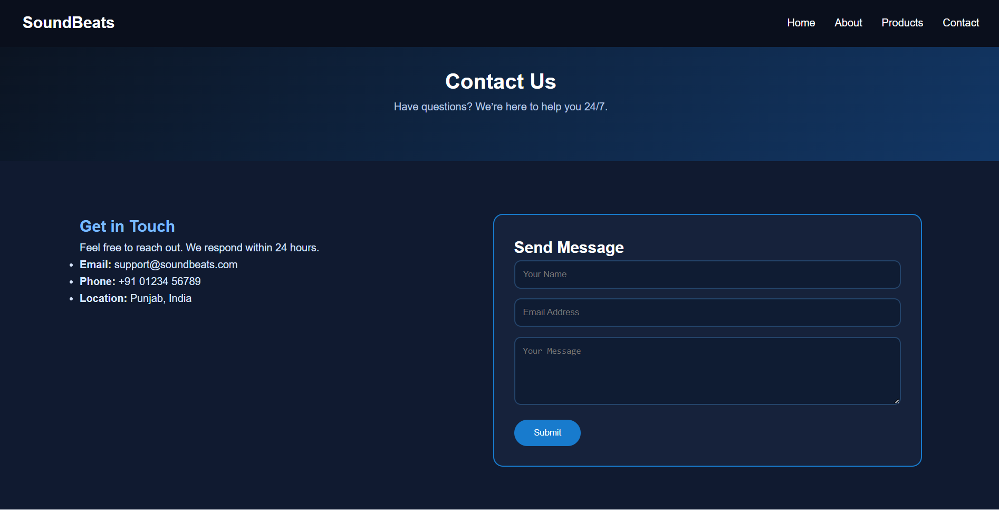

# Landing_Page
# 🎧 SoundBeats – Premium Headphone Website

A modern, responsive multi-page headphone website created using HTML and CSS.  
The design follows a dark-blue premium theme with clean UI, product cards, gallery, and contact form.

---

## 🚀 Pages Included
- Home (`index.html`)
- About (`about.html`)
- Products (`products.html`)
- Contact (`contact.html`)

---

## 🎨 Technologies Used
- HTML5  
- CSS3  
- Flexbox  
- CSS Grid  
- Responsive Web Design  
- Animations & Transitions  

---

## 🌐 Live Demo
https://dmukeshmvs.github.io/Landing_Page/

## 📸 Project Screenshots

### 🏠 Home Page

### 🧾 About Page

### 🎧 Products Page

### 📩 Contact Page

## 📘 What I Learned
- Designed a modern, responsive UI using advanced CSS (Flexbox, Grid, media queries).
- Implemented reusable styling using CSS variables and transitions.
- Understood multi-page website architecture and navigation structure.
- Improved skills in layout design, dark theme styling, and user interface consistency.
- Gained hands-on experience with GitHub workflows such as branching, pull requests, and version control.
- Successfully deployed the project using GitHub Pages and documented it with a proper README.

